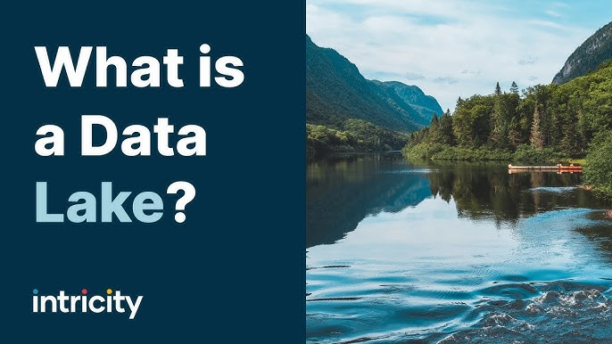

# Journal — 9-27-2025 — DAY 3

## 1) What I learned (bullets, not prose)
- Dimensional modeling and normalization are *not* an 'either/or' option
- Normalization and star schema may not be required but it is **good practice**, especially to unknown datasets. Cause it makes querying easier
- **RAW**: dump data
- **CLEAN**: where normalized/clean data goes
- **MART**: where star schema data goes, meant for end users
- Testing data before cleaning is important such as comparing the raw vs clean data, if the rows/columns match up, etc (**sense check**:check rows, sums, outliers at each stage)
- Dimensional tables, keep qualitative as much as possible while facts table would hold most your quantitative data

## 2) New vocabulary (define in your own words)
- **term** — my definition
- SQL - Structured Query language (https://www.w3schools.com/sql/sql_intro.asp)

## 3) Data Engineering mindset applied (what principles did I use?)
- Move data once!

## 4) Decisions & assumptions (why, alternatives, trade-offs)
- For an example exercise, I did X, because of Y

## 5) Open questions (things I still don’t get)
- huhuhu, what is a data lake?

## 6) Next actions (small, doable steps)
- [ ] study git

## 7) Artifacts & links (code, queries, dashboards)
- https://dataengineering.ph/

---

### Mini reflection (3–5 sentences)
What surprised me? What would I do differently next time? What will I watch out for in production?

I'm surprised at how cool git is!
